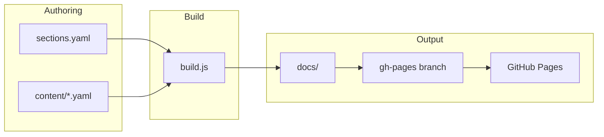

# Bhajan Sangrah — architecture

Static Hindi bhajan site: **content in YAML**, **HTML generated at build time**, deployed to **GitHub Pages** from the `docs/` output folder.

```
content/sections.yaml          → site config + section list
content/{section}/*.yaml       → one file per bhajan
        │
        ▼  node scripts/build.js
docs/                          → deployable static site (gitignored; rebuilt in CI)
  index.html                   → home
  {slug}.html                  → one page per section
  assets/                      → copied CSS, JS, icons, search-index.json
```

Live site base path: **`/bhajan-sangrah/`** (set in `content/sections.yaml` as `base_url`).

---

## Repository layout

| Path | Role |
|------|------|
| `content/sections.yaml` | Site title, `base_url`, icons, ordered list of sections |
| `content/{folder}/NNN-title.yaml` | Bhajan source files (Devanagari filenames OK) |
| `assets/css/site.css` | Styles (source; copied into `docs/assets/` on build) |
| `assets/js/nav.js` | Sidebar toggle, mobile nav |
| `assets/js/search.js` | Client-side search panel |
| `assets/icons/` | Section icons, favicon, home banner |
| `assets/banners/` | Optional extra banner images |
| `scripts/build.js` | **Main build** — wipes `docs/`, emits HTML + search index |
| `scripts/lib/` | Template, YAML I/O, lyrics HTML, search index, slugs |
| `docs/` | **Build output only** — do not edit by hand; regenerated every build |

### Build pipeline (`scripts/build.js`)

1. Read `content/sections.yaml`.
2. Delete and recreate `docs/`; write `.nojekyll` (GitHub Pages).
3. Copy `assets/` → `docs/assets/`.
4. Write `docs/index.html` (home: banner + links to all sections).
5. For each section: load all `*.yaml` in `content/{folder}/`, sort by filename, write `docs/{slug}.html`.
6. Build `docs/assets/search-index.json` from all bhajan titles + lyric lines.

### CI / hosting

`.github/workflows/build.yml` runs `node scripts/build.js` on push to `main`/`master` and deploys the `docs/` folder to the **`gh-pages`** branch. Enable **Settings → Pages → Deploy from branch → gh-pages → / (root)** once.

Local preview:

```bash
node scripts/build.js
npx serve docs -l 3000
# open http://localhost:3000/bhajan-sangrah/  (match base_url)
```

---

## Content model

### Site config (`content/sections.yaml`)

```yaml
base_url: /bhajan-sangrah/
site_title: भजन संग्रह
site_icon: assets/icons/favicon.jpg
home_banner: assets/icons/LandingPage.jpg

sections:
  - slug: shiv              # URL: {base_url}shiv.html
    folder: shiv            # YAML directory: content/shiv/
    google_path: shiv       # legacy; unused by build
    title: शिव भजन         # sidebar + page heading
    banner: assets/icons/lord_shiva.jpg   # optional
    grouped: true           # optional — sub-headings by `group:` on bhajans
```

### Bhajan YAML (`content/{section}/001-....yaml`)

| Field | Required | Description |
|-------|----------|-------------|
| `title` | yes | Display title |
| `lyrics` | yes | Structured object (preferred) or plain multiline string |
| `tarz` | no | Tune / style line shown above lyrics |
| `pre_shlok` | no | Opening doha / shloka before main lyrics (inside `lyrics:`; not स्थायी) |
| `commentary` | no | Inline टीका blocks in `paragraphs` (styled like pre_shlok/dhvani, no verse numbers) |
| `dhvani` / `shlok` | no | Post-shloka after lyrics (inside `lyrics:`) |
| `jabani` | no | Prose explanation (e.g. charitra) |
| `group` | no | Sub-section name when section has `grouped: true` |
| `swarachit: true` | no | Shows “स्वरचित” badge (except on `swarachit` section page) |

**Structured lyrics** (recommended):

```yaml
title: जय गणेश देवा
lyrics:
  sthayi: |
    जय गणेश जय गणेश, जय गणेश देवा।
    माता जाकी पार्वती, पिता महादेवा॥
  paragraphs:
    - |
      एक दंत दयावंत, चार भुजा धारी…
    - |
      अंधन को आंख देत…
  dhvani: |
    वक्रतुण्ड महाकाय…॥
```

- **`pre_shlok`** — opening verses before the song body (inside `lyrics:`); no स्थायी markers.
- **`commentary`** — `- commentary: |` in `paragraphs`; टीका blocks (no verse numbers).
- **`sthayi`** — refrain / main hook (rendered at start of numbered lyrics).
- **`sthayi_connect`** — **on by default** (`sthayi_connect: true` in `sections.yaml`). Each antara’s last line also ends with `....` + refrain; the full `sthayi` block with `॥स्थायी॥` still prints first. Disable per bhajan with `sthayi_connect: false` under `lyrics:` (or top-level on the bhajan file), or per section in `sections.yaml`.
- **`sthayi_connect_text`** — optional exact refrain string under `lyrics:` (e.g. `ॐ जय शिव ओंकारा`). If omitted, first 3 words of `sthayi` are used (longer → `...`).
- **`paragraphs`** — antaras (`- |`) and optional `- commentary: |` entries, in order.
- **`dhvani`** / **`shlok`** — closing shloka after lyrics (inside `lyrics:`).
- **`sthayi_marker`** — optional text in lyrics that triggers repeating the sthayi between paragraphs (advanced).
- **`parts`** — for multi-part bhajans (e.g. long charitra): array of `{ sthayi, paragraphs, sthayi_marker? }`.

Filenames are sorted lexicographically (`001-…`, `002-…`) — that order is the **bhajan number** on the page.

---

## Generated HTML

Every public page shares:

- Sidebar with links to all sections (`renderSidebar` in `scripts/lib/template.js`).
- Search toggle → right panel (`assets/js/search.js` + `search-index.json`).
- Noto Sans Devanagari (Google Fonts).

**Section page** (`{slug}.html`):

1. Optional banner image.
2. Section title.
3. Numbered **भजन सूची** (anchor index).
4. **Bhajan cards** — title, lyrics HTML (pre_shlok, sthayi, antaras, commentary, dhvani), optional jabani, “सूची ↑” back to index.

**Home** (`index.html`): home banner + list of section links.

Anchor IDs are stable: `{slug}-{title-slug}-{NN}` (see `scripts/lib/slug.js`).

---

## npm scripts

| Command | Purpose |
|---------|---------|
| `npm run build` | Generate `docs/` |
| `npm run add-bhajan` | Interactive new bhajan YAML |
| `npm run add-section` | Interactive new section + folder |
| `npm run clean-content` | Strip junk lines from all YAML |
| `npm run fix-danda` | Normalize danda (।) in lyrics |
| `npm run serve` | Serve `docs/` locally (after build) |
| `npm run export-pdf` | Full-site PDF → `output/bhajan-sangrah.pdf` |

### Admin editor (Vercel)

Separate deploy under `admin/` — GitHub OAuth, allowlisted user, commits to `main`. See [admin/README.md](admin/README.md).

---

## PDF export

The live site has **no PDF button**. PDFs are generated only on demand.

**GitHub Actions:** **Actions → Export PDF → Run workflow** → download artifact **bhajan-sangrah-pdf** (`bhajan-sangrah.pdf`). Not part of the site build/deploy.

**Locally:**

```bash
npm install
npm run export-pdf   # → output/bhajan-sangrah.pdf (+ output/pdf-export.html preview)
```

**CI deploy** runs only `node scripts/build.js` (no Puppeteer, no PDF).

One printable document lists every bhajan in **भजन सूची** (grouped by section; titles and dotted leaders only, no page numbers). Section banners use `banner:` in `sections.yaml`.

| File | Role |
|------|------|
| `.github/workflows/export-pdf.yml` | Manual workflow; uploads PDF artifact |
| `scripts/export-pdf.js` | Loads YAML, writes HTML, prints PDF via Puppeteer |
| `scripts/lib/pdf-template.js` | Single-document HTML (cover, master index, sections) |
| `assets/css/pdf-export.css` | A4 `@page`, index rows, typography |

**`npm run export-pdf`:** one-pass PDF export. Index links still jump to each bhajan (`b001`…`b199` anchors). Footer shows `page / total` on each sheet only.

---

## How to add a new bhajan

### Option A — CLI (simple lyrics)

```bash
npm run add-bhajan
```

Prompts: section number, title, optional tarz, swarachit (y/N), then lyrics lines (blank line to finish). Writes e.g. `content/shiv/009-नया-भजन.yaml` with plain `lyrics: |` block.

### Option B — Edit YAML by hand (recommended for aartis / sthayi + paragraphs)

1. Pick the section folder, e.g. `content/ram/`.
2. Choose the next index: if last file is `015-…`, use `016-…`.
3. Create `016-शीर्षक.yaml` using the structured example above.
4. Build:

```bash
node scripts/build.js
```

5. Commit **`content/`** changes (and push; CI rebuilds `docs/` on `gh-pages`).

**Tips**

- Use `॥` at end of lines where appropriate; run `npm run fix-danda` if punctuation is inconsistent.
- For **swarachit** bhajans in other sections, set `swarachit: true`.
- For **grouped** sections (`swarachit`, or `grouped: true` in `sections.yaml`), set `group: समूह का नाम` on each bhajan.

---

## How to add a new section

A “section” is a **category page** (`{slug}.html`) plus a folder of bhajans.

### Option A — CLI

```bash
npm run add-section
```

Prompts: slug, folder (default = slug), Hindi title, google_path. Updates `sections.yaml` and creates `content/{folder}/`.

### Option B — Manual

1. Add an entry to `content/sections.yaml`:

```yaml
  - slug: sant
    folder: sant
    google_path: sant
    title: संत भजन
    banner: assets/icons/sant.jpg
```

2. Create `content/sant/` and add bhajan YAML files.

3. Add `assets/icons/sant.jpg` (or set `banner` to an existing icon path).

4. Build and verify sidebar + `sant.html`.

Section order in the sidebar matches order in `sections.yaml`.

---

## How to add a new page

The build only emits:

| Page | Source |
|------|--------|
| Home | `renderIndex()` — always `index.html` |
| Section | One HTML file per row in `sections.yaml` — `{slug}.html` |

There is **no** generic “custom page” hook yet. Use one of these patterns:

### 1. New section (usual case)

If the content is a collection of bhajans, add a **section** (above). That automatically creates a new page and sidebar link.

### 2. Static asset or external link

For a one-off PDF, image, or external site: link from home or section body via a future custom block — today, only section list on home.

### 3. Custom standalone HTML page (requires code change)

To add e.g. `about.html`:

1. Add optional `extra_pages` (or similar) to `sections.yaml`, **or** hard-code in `scripts/build.js`:

```javascript
fs.writeFileSync(
  path.join(DOCS, 'about.html'),
  renderPage({
    pageTitle: 'परिचय',
    body: '<main class="content-main"><h1>…</h1></main>',
    config,
    sections,
    base,
    currentSlug: null,
  }),
  'utf8'
);
```

2. Add a sidebar link in `renderNav()` / `renderSidebar()` if it should appear in navigation.

3. Rebuild. Do **not** hand-edit files under `docs/` — they are deleted on each build.

### 4. Home page content

Change `renderIndex()` in `scripts/lib/template.js` or `home_banner` / `site_title` in `sections.yaml`. The home page is not a separate YAML file.

---

## Search

- **Index**: `scripts/lib/search-index.js` — tokenizes title + all lyric lines (sthayi + paragraphs).
- **Client**: `assets/js/search.js` — loads `assets/search-index.json`; single-word = exact token; multi-word = all tokens must match (AND).
- Rebuilt automatically on every `npm run build`.

---

## Key modules

| Module | Responsibility |
|--------|----------------|
| `scripts/lib/sections.js` | Load/save `sections.yaml`, list bhajan files |
| `scripts/lib/yaml-io.js` | Parse/write bhajan + sections YAML |
| `scripts/lib/lyrics-structure.js` | Structured lyrics helpers; used by `escape.js` |
| `scripts/lib/escape.js` | `lyricsToHtml`, `preShlokToHtml`, `dhvaniToHtml`, `jabaniToHtml` |
| `scripts/lib/template.js` | HTML shell, sidebar, section/home pages |
| `scripts/lib/search-index.js` | JSON search index |
| `scripts/lib/slug.js` | Filename + anchor id generation |
| `scripts/lib/danda.js` | Danda normalization (`fix-danda`) |
| `scripts/lib/clean-lyrics.js` | Content cleanup (`clean-content`) |

---

## Workflow summary



1. Edit YAML in `content/`.
2. Run `node scripts/build.js` locally to preview.
3. Commit and push `content/` (and `assets/` / `scripts/` if changed).
4. CI publishes fresh `docs/` to GitHub Pages.

---

## What not to edit

- **`docs/`** — generated; overwritten every build.
- **Migration / scraper tooling** — removed; content is maintained directly in YAML.

For questions about a specific bhajan file, open the matching `content/{section}/NNN-*.yaml` and the built `{slug}.html` after running the build.
